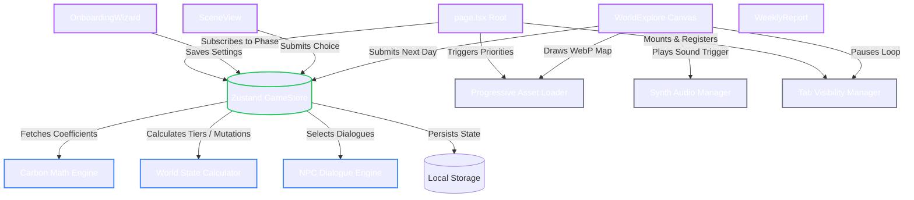

# 🌿 EcoPixel v2.0
> **An Interactive Narrative Carbon Footprint Simulator**

[](https://nextjs.org)
[](https://react.dev)
[](https://www.typescriptlang.org)
[](https://github.com/pmndrs/zustand)
[](https://developer.mozilla.org/en-US/docs/Web/API/Web_Audio_API)

EcoPixel is a lightweight, high-performance narrative life simulator where player choices dynamically shape the environment. By making decisions throughout a simulated day—from how they light their room in the morning to what they eat for lunch—players receive real-time feedback on their carbon footprint in kilograms of $\text{CO}_2\text{e}$. Streaks of sustainable or high-emission choices trigger instant environmental mutations (such as spawning trees or increasing smog) in an interactive pixel-art world map.

---

## 🗺️ System Architecture Blueprint

EcoPixel is built with a highly decoupled, modular architecture designed for performance, browser responsiveness, and state persistence. Below is the data flow and system integration model:



---

## 🛠️ Core Engines & Implementation Detail

### 1. Game State & Phase Controller
* **Source:** [gameStore.ts](file:///c:/Users/karan/promotwar/src/lib/gameStore.ts)
* **Description:** Built on Zustand, the store operates a finite state machine managing game phases (`title` → `onboarding` → `scene` → `afternoon_event` → `summary` → `explore` → `weekly_report`).
* **Design Pattern:** Persistent middleware caches state to browser local storage. A partialized state filter ensures non-serializable objects (like loaders and callback listeners) are kept out of storage.

### 2. Carbon Math Calculation
* **Source:** [carbonMath.ts](file:///c:/Users/karan/promotwar/src/lib/carbonMath.ts)
* **Description:** Resolves emission totals using regional Grid Emission Coefficients ($\text{CO}_2\text{e}$).
* **Coefficients:** 
  * `IN` (India): 1.0 (baseline)
  * `US` (USA): 1.3
  * `EU` (Europe): 0.8 (cleaner grid)
  * `CN` (China): 1.2
* **Target thresholds:** Daily Clean Threshold is set to $25 \text{ kg CO}_2\text{e}$ with a daily sustainability target of $8.2 \text{ kg}$ (correlating to the global $3 \text{ tonnes/year}$ target).

### 3. Dynamic World Mutations & Tiers
* **Source:** [worldState.ts](file:///c:/Users/karan/promotwar/src/lib/worldState.ts)
* **Description:** Translates cumulative scores into environmental tiers:
  * **Pristine** ($<80 \text{ kg}$): Vibrant sky, high tree count, clean water.
  * **Fair** ($80\text{--}199 \text{ kg}$): Hazy overlay, moderate tree health.
  * **Degraded** ($200\text{--}399 \text{ kg}$): Dim grey sky, thin trees, smog particles.
  * **Polluted** ($\ge 400 \text{ kg}$): Smog overlay, dead vegetation, heavy smoke.
* **Streak Mutations:** 3-day Clean Streaks trigger healing mutations (`spawnTree`, `clearWater`, `reduceSmoke`). 3-day Dirty Streaks spawn smog warnings or increase smoke.

### 4. Contextual NPC Dialogues
* **Source:** [npcEngine.ts](file:///c:/Users/karan/promotwar/src/lib/npcEngine.ts)
* **Data Schema:** [npcDialogue.json](file:///c:/Users/karan/promotwar/src/data/npcDialogue.json)
* **Description:** A reactive rule engine that queries the player's recent action logs. If a player relies on heavy fossil-fuel choices over 5 days, the NPC triggers targeted advice (e.g. suggesting opening curtains). It also celebrates sustainable streaks or provides warning alerts for degraded ecosystems.

### 5. Progressive Asset Delivery
* **Source:** [assetLoader.ts](file:///c:/Users/karan/promotwar/src/lib/assetLoader.ts)
* **Description:** Minimizes initial load times by prioritizing assets:
  * **Startup Queue:** Critical splash/map files ($<2\text{MB}$) loaded immediately.
  * **Gameplay Queue:** Background environments streamed asynchronously as the player changes scenes.
  * **Background Queue:** Prefetches assets for upcoming scenes based on current game phase state.
* **Fallbacks:** Automatically attempts to deliver optimized modern `.webp` textures, falling back to standard `.png` images if the browser fails to decode WebP.

### 6. Oscillator-Based Audio Synthesis
* **Source:** [audioManager.ts](file:///c:/Users/karan/promotwar/src/lib/audioManager.ts)
* **Description:** Zero external audio file payloads. Generates 8-bit sound effects directly in the browser via the Web Audio API.
* **Tones:**
  * `click`: Square wave ($800\text{Hz}$, $0.05\text{s}$)
  * `choice_good`: Major chord ($C_5, E_5, G_5$) using smooth sine waves
  * `choice_bad`: Minor chord ($E\flat_4, G\flat_4, B\flat_4$) using sawtooth waves
  * `scene_transition` & `day_complete`: Dynamic arpeggios
  * `ambient`: Multi-frequency lower octave ambient pad
* **Browser Compliance:** Instantiates the `AudioContext` only after the first user gesture (click/keydown) to comply with modern browser autoplay policies.

### 7. Resource-Aware Tab Visibility
* **Source:** [tabVisibility.ts](file:///c:/Users/karan/promotwar/src/lib/tabVisibility.ts)
* **Description:** Listens for browser `visibilitychange` events. When the tab loses focus, it pauses the HTML5 Canvas animation loop and suspends ambient sound generation, preventing background tab CPU/battery drain.

---

## 📁 Repository Structure

```
├── public/                 # Static assets (WebP & PNG fallback sprites)
├── src/
│   ├── app/                # Next.js Page & Global Styling
│   │   ├── globals.css     # CSS Variables, Retro Font mappings, Scanline Effects
│   │   ├── layout.tsx      # Main Layout, Next.js Google Fonts setup
│   │   └── page.tsx        # App Root, Loader rendering, Phase router
│   │
│   ├── components/         # Game Views & UI Components
│   │   ├── AfternoonEventView.tsx  # Randomized choice prompts
│   │   ├── DaySummary.tsx  # Daily Carbon ledger & NPC feedback
│   │   ├── OnboardingWizard.tsx    # User config: Grid/Diet/Location
│   │   ├── SceneView.tsx   # Core narrative choice node renderer
│   │   ├── TitleScreen.tsx # Animated retro splash screen
│   │   ├── WeeklyReport.tsx# Aggregate 7-day carbon ledger report
│   │   └── WorldExplore.tsx# Canvas-based top-down world exploration
│   │
│   ├── data/               # Scenario Data
│   │   ├── afternoonEvents.json    # Random choice events
│   │   ├── npcDialogue.json        # Dialogue nodes by tier / rule
│   │   └── scenes.json             # Core morning/day/evening scenario trees
│   │
│   └── lib/                # Core Utility & Engine Libraries
│       ├── assetLoader.ts  # Progressive Loader
│       ├── audioManager.ts # Oscillator Audio Synthesizer
│       ├── carbonMath.ts   # Carbon Metric Engine
│       ├── gameStore.ts    # Zustand State Machine
│       ├── npcEngine.ts    # Dialogue Selector
│       ├── tabVisibility.ts# Focus / Throttling listener
│       ├── weeklyReport.ts # Weekly calculator
│       └── worldState.ts   # Mutation / World Tier mapper
```

---

## 🚀 Getting Started

### Prerequisites
* Node.js v18.0+
* npm, yarn, pnpm, or bun

### Installation
```bash
# Clone the repository
git clone https://github.com/NeuroKaran/PromptWar.git
cd PromptWar

# Install dependencies
npm install
```

### Development Server
```bash
npm run dev
```
Open [http://localhost:3000](http://localhost:3000) to view the simulator in development mode.

### Production Build
```bash
# Compile TypeScript and build Next.js optimization bundle
npm run build

# Start production server
npm run start
```

---

## 📖 Extension Guide

### How to Add a New Choice Scene
1. Open [scenes.json](file:///c:/Users/karan/promotwar/src/data/scenes.json).
2. Append a new scene object mapping to the environment.
3. Define steps within the scene. Each step must contain:
   * A unique `id`
   * A `prompt` string
   * A `choices` array listing labels, emojis, `co2` impact values, and the `next` step pointer (or `"END"` to transition to the next phase).

```json
"night_routine": {
  "environment": "bedroom",
  "background": "/assets/Home.png",
  "title": "Night Routine",
  "steps": [
    {
      "id": "power_down",
      "prompt": "How do you shut down your workspace?",
      "choices": [
        { "id": "power_off", "label": "Switch off power strips", "emoji": "🔌", "co2": 0, "next": "END" },
        { "id": "standby", "label": "Leave devices on standby", "emoji": "🌙", "co2": 1, "next": "END" }
      ]
    }
  ]
}
```

### How to Add Custom Synthesis Sound Effects
1. Open [audioManager.ts](file:///c:/Users/karan/promotwar/src/lib/audioManager.ts).
2. Register a new ID in the `SoundId` union type.
3. Implement a custom oscillator node chain in `play()`. For example, a retro laser sound:
```typescript
case 'laser':
  // Slide frequency down from 1200Hz to 100Hz
  const osc = this.context.createOscillator();
  const gain = this.context.createGain();
  osc.frequency.setValueAtTime(1200, this.context.currentTime);
  osc.frequency.exponentialRampToValueAtTime(100, this.context.currentTime + 0.15);
  // Connect and play...
  break;
```

---

## 📈 Performance & Best Practices (Games-skills.md Compliance)

EcoPixel conforms directly to high-efficiency web game principles outlined in the development guidelines:

| Rule Category | Applied Implementation |
| :--- | :--- |
| **Progressive Asset Loading** | Core startup payload is restricted to $<2\text{MB}$. Additional assets are loaded on demand and prefetched in the background based on game phase. |
| **Tab Throttling** | The Canvas game loop pauses and `AudioContext` yields execution when the document's `visibilityState` changes to `hidden`. |
| **Autoplay Audio Policy** | Synthesizer initializers do not block startup; they wait for the first user interaction to invoke `AudioContext.resume()`. |
| **Asset Compression** | Graphics are compiled into optimized WebP formats with robust PNG file fallbacks. |
| **GC Optimization** | Uses lightweight JSON files for static data storage and utilizes static object pools for vector positioning in [WorldExplore.tsx](file:///c:/Users/karan/promotwar/src/components/WorldExplore.tsx). |
